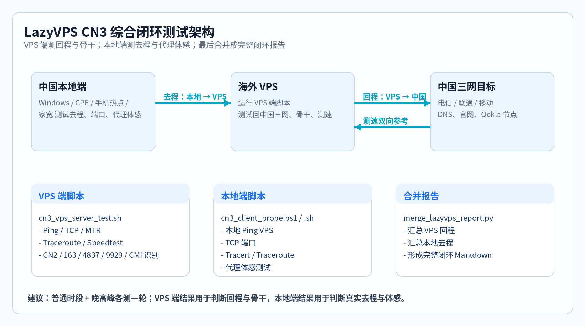
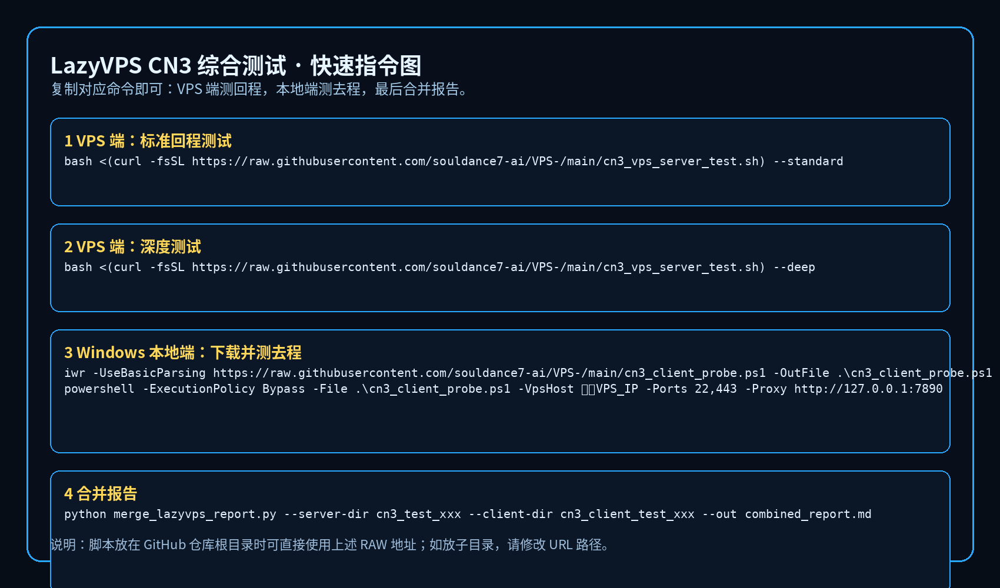

# LazyVPS CN3 综合闭环测试包

<p align="center">
  <b>VPS 端回程测试 + 中国本地端去程测试 + 代理体感测试 + 合并报告</b><br>
  <sub>中国电信 / 中国联通 / 中国移动 · CMD 仪表盘 · 回程骨干识别 · Markdown / CSV 留档</sub>
</p>

<p align="center">
  
  
  
  
</p>

---

## 项目定位

这个项目不是单纯测“回程”的脚本，而是一个 **中国联外网 VPS 综合闭环测试包**。

它分成三层：

| 层级 | 执行位置 | 主要目的 |
|---|---|---|
| VPS 端测试 | 海外 VPS | 测 VPS → 中国三网，也就是常说的回程、骨干、延迟、丢包、测速 |
| 本地端测试 | Windows / Linux / CPE / 中国本地网络 | 测 中国本地 → VPS，也就是去程、端口、Tracert、连接质量 |
| 代理体感测试 | 中国本地端，通过本地代理 | 测 Google / GitHub / OpenAI / Cloudflare 等实际访问体感 |

> 评分是 **VPS 中国方向质量评估口径**，不是家宽跑满带宽模型；评级仅供参考。

---

# 交互式菜单模式

如果你已经登录 VPS，最推荐直接运行脚本本体，不带任何参数：

**VPS/Linux 执行：**

```bash
bash cn3_vps_server_test.sh
```

进入后会出现菜单：

```text
1) 快速体验测试
2) 标准综合测试（推荐）
3) 深度三网测试
4) 仅延迟路由测试
5) 安装/补齐依赖
6) 帮助说明
0) 退出
```

支持两种操作方式：

```text
- 直接按数字 1/2/3/4/5/6/0
- 使用 ↑ ↓ 方向键选择，Enter 确认
```

如果你是在 Windows CMD 远程触发 VPS 执行，并且不想进入菜单，就继续使用：

```cmd
ssh root@你的VPS_IP "bash -lc 'curl -fsSL -o /root/cn3_vps_server_test.sh https://raw.githubusercontent.com/souldance7-ai/VPS-/main/cn3_vps_server_test.sh && chmod +x /root/cn3_vps_server_test.sh && bash /root/cn3_vps_server_test.sh --standard'"
```

---

# Windows CMD 正确执行方式

> **重要修正：** Windows CMD 不能直接运行 `bash <(curl ...)`。  
> 那是 Linux Bash 的语法，会出现：`The system cannot find the file specified.`  
> 如果你是在 Windows CMD 里操作，应使用下面的 **SSH 远程触发 VPS 执行** 方式。

## 方式一：Windows CMD 一条命令远程触发 VPS 标准测试

**Windows CMD 执行：**

```cmd
ssh root@你的VPS_IP "bash -lc 'curl -fsSL -o /root/cn3_vps_server_test.sh https://raw.githubusercontent.com/souldance7-ai/VPS-/main/cn3_vps_server_test.sh && chmod +x /root/cn3_vps_server_test.sh && bash /root/cn3_vps_server_test.sh --standard'"
```

示例：

```cmd
ssh root@103.97.200.42 "bash -lc 'curl -fsSL -o /root/cn3_vps_server_test.sh https://raw.githubusercontent.com/souldance7-ai/VPS-/main/cn3_vps_server_test.sh && chmod +x /root/cn3_vps_server_test.sh && bash /root/cn3_vps_server_test.sh --standard'"
```

## 方式二：Windows CMD 远程安装依赖并测试

**Windows CMD 执行：**

```cmd
ssh root@你的VPS_IP "bash -lc 'curl -fsSL -o /root/cn3_vps_server_test.sh https://raw.githubusercontent.com/souldance7-ai/VPS-/main/cn3_vps_server_test.sh && chmod +x /root/cn3_vps_server_test.sh && bash /root/cn3_vps_server_test.sh --install --standard'"
```

## 方式三：Windows CMD 远程深度测试

**Windows CMD 执行：**

```cmd
ssh root@你的VPS_IP "bash -lc 'curl -fsSL -o /root/cn3_vps_server_test.sh https://raw.githubusercontent.com/souldance7-ai/VPS-/main/cn3_vps_server_test.sh && chmod +x /root/cn3_vps_server_test.sh && bash /root/cn3_vps_server_test.sh --deep'"
```

## 方式四：Windows CMD 手动上传后运行

**Windows CMD 执行：**

```cmd
scp .\cn3_vps_server_test.sh root@你的VPS_IP:/root/cn3_vps_server_test.sh
ssh root@你的VPS_IP
```

进入 VPS 后：

**VPS/Linux 执行：**

```bash
cd /root
chmod +x cn3_vps_server_test.sh
bash cn3_vps_server_test.sh --standard
```

---

# Windows 本地端去程 / 代理体感测试

**Windows CMD 执行：**

```cmd
powershell -NoProfile -ExecutionPolicy Bypass -Command "iwr -UseBasicParsing https://raw.githubusercontent.com/souldance7-ai/VPS-/main/cn3_client_probe.ps1 -OutFile .\cn3_client_probe.ps1; .\cn3_client_probe.ps1 -VpsHost 你的VPS_IP -Ports 22,443 -Proxy http://127.0.0.1:7890"
```

如果没有本地代理，只测去程与端口：

**Windows CMD 执行：**

```cmd
powershell -NoProfile -ExecutionPolicy Bypass -Command "iwr -UseBasicParsing https://raw.githubusercontent.com/souldance7-ai/VPS-/main/cn3_client_probe.ps1 -OutFile .\cn3_client_probe.ps1; .\cn3_client_probe.ps1 -VpsHost 你的VPS_IP -Ports 22,443"
```

---

# Linux Bash 在线执行方式

如果你已经在 **VPS/Linux Bash** 里面，可以使用下面命令：

**VPS/Linux 执行：**

```bash
bash <(curl -fsSL https://raw.githubusercontent.com/souldance7-ai/VPS-/main/cn3_vps_server_test.sh) --standard
```

> 注意：这条只适合 Linux Bash，不适合 Windows CMD。

---

---

## 架构说明图



## 快速指令图



---

## 一键下载执行

### 1）VPS 端：标准回程测试

**VPS/Linux 执行：**

```bash
bash <(curl -fsSL https://raw.githubusercontent.com/souldance7-ai/VPS-/main/cn3_vps_server_test.sh) --standard
```

### 2）VPS 端：首次安装依赖并测试

**VPS/Linux 执行：**

```bash
bash <(curl -fsSL https://raw.githubusercontent.com/souldance7-ai/VPS-/main/cn3_vps_server_test.sh) --install --standard
```

### 3）VPS 端：深度测试

**VPS/Linux 执行：**

```bash
bash <(curl -fsSL https://raw.githubusercontent.com/souldance7-ai/VPS-/main/cn3_vps_server_test.sh) --deep
```

### 4）Windows 本地端：下载并测试去程 / 代理体感

**Windows PowerShell 执行：**

```powershell
iwr -UseBasicParsing https://raw.githubusercontent.com/souldance7-ai/VPS-/main/cn3_client_probe.ps1 -OutFile .\cn3_client_probe.ps1
powershell -ExecutionPolicy Bypass -File .\cn3_client_probe.ps1 -VpsHost 你的VPS_IP -Ports 22,443 -Proxy http://127.0.0.1:7890
```

### 5）Linux / macOS 本地端：下载并测试去程

**Linux/macOS 执行：**

```bash
curl -fsSL -o cn3_client_probe.sh https://raw.githubusercontent.com/souldance7-ai/VPS-/main/cn3_client_probe.sh
chmod +x cn3_client_probe.sh
bash cn3_client_probe.sh --host 你的VPS_IP --ports 22,443 --proxy http://127.0.0.1:7890
```

---

## 本地下载后运行

### VPS 端

**VPS/Linux 执行：**

```bash
curl -fsSL -o cn3_vps_server_test.sh https://raw.githubusercontent.com/souldance7-ai/VPS-/main/cn3_vps_server_test.sh
chmod +x cn3_vps_server_test.sh
bash cn3_vps_server_test.sh --standard
```

### Windows 本地端

**Windows PowerShell 执行：**

```powershell
iwr -UseBasicParsing https://raw.githubusercontent.com/souldance7-ai/VPS-/main/cn3_client_probe.ps1 -OutFile .\cn3_client_probe.ps1
powershell -ExecutionPolicy Bypass -File .\cn3_client_probe.ps1 -VpsHost 你的VPS_IP -Ports 22,443 -Proxy http://127.0.0.1:7890
```

---

## 脚本说明

### `cn3_vps_server_test.sh`

在海外 VPS 上运行，用于观察：

- VPS → 中国电信 / 联通 / 移动
- Ping / 丢包 / TCP Connect
- MTR / Traceroute
- Speedtest 到中国节点
- 回程骨干识别：CN2、163、169/4837、9929/CUII、CMNET、CMI 等
- CMD 表格仪表盘 + 柱状组合图

### `cn3_client_probe.ps1`

在 Windows 本地运行，用于观察：

- 中国本地 → VPS 的 Ping / 丢包
- 中国本地 → VPS 端口 TCP 连接
- Tracert 到 VPS
- 可选：通过本地代理测试 Google / GitHub / OpenAI / Cloudflare
- CMD 表格化输出 + CSV + Markdown

### `cn3_client_probe.sh`

在 Linux / macOS 本地运行，用于观察：

- 本地 → VPS 的 Ping / 丢包
- 本地 → VPS 端口 TCP 连接
- Traceroute 到 VPS
- 可选：通过本地代理测试目标站点

### `merge_lazyvps_report.py`

用于合并两端结果：

```bash
python merge_lazyvps_report.py --server-dir cn3_test_xxx --client-dir cn3_client_test_xxx --out combined_report.md
```

输出一个完整的闭环 Markdown 报告。

---

## 推荐测试流程

### 第一步：VPS 上测回程

**VPS/Linux 执行：**

```bash
bash cn3_vps_server_test.sh --standard
```

得到类似：

```text
cn3_test_YYYYmmdd_HHMMSS/
├── report.md
├── cn3_overview.csv
├── route_backbone_summary.csv
├── latency_summary.csv
├── speedtest_summary.csv
├── mtr/
└── traceroute/
```

### 第二步：中国本地测去程

**Windows PowerShell 执行：**

```powershell
powershell -ExecutionPolicy Bypass -File .\cn3_client_probe.ps1 -VpsHost 你的VPS_IP -Ports 22,443 -Proxy http://127.0.0.1:7890
```

得到类似：

```text
cn3_client_test_YYYYmmdd_HHMMSS/
├── client_report.md
├── client_summary.csv
├── tcp_ports.csv
├── proxy_experience.csv
└── tracert_to_vps.txt
```

### 第三步：合并报告

**本地电脑或 VPS 执行：**

```bash
python merge_lazyvps_report.py --server-dir cn3_test_YYYYmmdd_HHMMSS --client-dir cn3_client_test_YYYYmmdd_HHMMSS --out combined_report.md
```

---

## 结果怎么看

| 结果 | 看什么 |
|---|---|
| VPS 端综合评分 | VPS 回中国三网方向整体质量 |
| VPS 端回程骨干 | 是否走 CN2 / 163 / 169 / 9929 / CMI 等 |
| 本地端 Ping | 中国本地到 VPS 的去程延迟 |
| 本地端 TCP | 代理端口或 SSH 端口是否容易连上 |
| 代理体感 | Google / GitHub / OpenAI 等实际体验 |
| 合并报告 | 去程 + 回程 + 体感的最终闭环判断 |

---

## 输出目录建议

如果你上传到 GitHub，推荐目录结构：

```text
LazyVPS-CN3-Comprehensive-Test/
├── cn3_vps_server_test.sh
├── cn3_client_probe.ps1
├── cn3_client_probe.sh
├── merge_lazyvps_report.py
├── README.md
├── QUICK_START.md
├── LICENSE
└── docs/
    ├── full-chain-architecture.png
    └── quick-command-card.png
```

---

## 注意事项

- VPS 端脚本看的是 **VPS → 中国**，通常用于回程和骨干观察。
- 本地端脚本看的是 **中国本地 → VPS**，用于去程和真实连接质量。
- Speedtest 上下行只是 VPS 与测试节点之间的双向吞吐参考，不完全等于你的手机 / CPE / 家宽体感。
- 最终判断建议普通时段与晚高峰各测一轮。

---

## License

MIT
