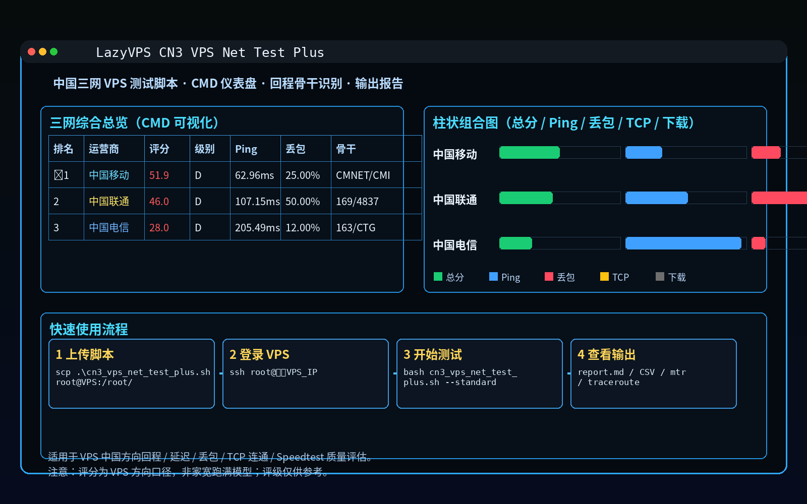
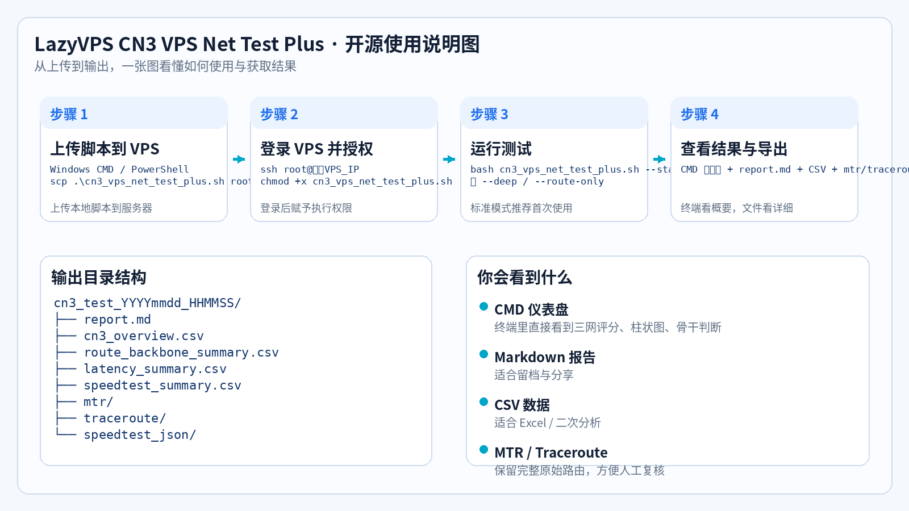

# LazyVPS CN3 VPS Net Test Plus

<p align="center">
  <b>中国电信 / 中国联通 / 中国移动 三网 VPS 方向质量测试脚本</b><br>
  <sub>CMD 仪表盘 · 回程骨干识别 · 延迟 / 丢包 / TCP / 测速 · Markdown / CSV / 路由留档</sub>
</p>

<p align="center">
  
  
  
  
</p>

---

## 项目简介

`LazyVPS CN3 VPS Net Test Plus` 是一个面向 **海外 VPS / 中转机 / 代理节点** 的中国三网方向测试脚本。  
它不是“家宽跑满测速”脚本，而是更偏向 **VPS 对中国方向网络质量评估**：

- 中国电信 / 中国联通 / 中国移动 三网分别测试
- 关注 **Ping、丢包、TCP 连通、回程骨干、Speedtest**
- 最终在 **CMD 终端** 中直接输出 **表格化仪表盘 + 柱状组合图**
- 同时生成 `Markdown`、`CSV`、`MTR`、`Traceroute` 等留档文件

> **注意：** 本项目评分口径为 **VPS 中国方向质量评估**，并非家用宽带测速模型，**评级仅供参考**。

> **最快使用：**
>
> ```bash
> bash <(curl -fsSL https://raw.githubusercontent.com/souldance7-ai/VPS-/main/cn3_vps_net_test_plus.sh) --standard
> ```


---

## 功能特性

- ✅ 中国电信 / 中国联通 / 中国移动 三网分开测试
- ✅ CMD 终端可视化结果页（表格总览 + 柱状组合图）
- ✅ 回程骨干识别（如 CN2、163、169/4837、9929/CUII、CMNET、CMI 等）
- ✅ 支持 `quick` / `standard` / `deep` / `route-only` 模式
- ✅ 输出 `Markdown 报告`、`CSV 汇总`、`MTR / Traceroute 原始结果`
- ✅ 适合 VPS 测评、机场留档、自建节点回程观察

---

## 效果预览

### 1）项目预览图



### 2）开源使用说明图



---

## 一键下载执行

如果你把 `cn3_vps_net_test_plus.sh` 放在 GitHub 仓库根目录，用户可以直接复制下面命令运行。

> 当前按你的仓库地址预填：`souldance7-ai/VPS-`  
> 若你后续换仓库名，只需要把命令里的 RAW 地址改掉即可。

### 方式一：直接在线运行

**VPS/Linux 执行：**

```bash
bash <(curl -fsSL https://raw.githubusercontent.com/souldance7-ai/VPS-/main/cn3_vps_net_test_plus.sh) --standard
```

### 方式二：下载到本地再运行，推荐

**VPS/Linux 执行：**

```bash
curl -fsSL -o cn3_vps_net_test_plus.sh https://raw.githubusercontent.com/souldance7-ai/VPS-/main/cn3_vps_net_test_plus.sh
chmod +x cn3_vps_net_test_plus.sh
bash cn3_vps_net_test_plus.sh --standard
```

### 方式三：wget 下载运行

**VPS/Linux 执行：**

```bash
wget -O cn3_vps_net_test_plus.sh https://raw.githubusercontent.com/souldance7-ai/VPS-/main/cn3_vps_net_test_plus.sh
chmod +x cn3_vps_net_test_plus.sh
bash cn3_vps_net_test_plus.sh --standard
```

### 首次安装依赖并测试

**VPS/Linux 执行：**

```bash
bash <(curl -fsSL https://raw.githubusercontent.com/souldance7-ai/VPS-/main/cn3_vps_net_test_plus.sh) --install --standard
```

### 深度测试

**VPS/Linux 执行：**

```bash
bash <(curl -fsSL https://raw.githubusercontent.com/souldance7-ai/VPS-/main/cn3_vps_net_test_plus.sh) --deep
```

### 只看延迟 / 回程骨干

**VPS/Linux 执行：**

```bash
bash <(curl -fsSL https://raw.githubusercontent.com/souldance7-ai/VPS-/main/cn3_vps_net_test_plus.sh) --route-only
```

### 如果脚本放在子目录

如果你不是放在仓库根目录，而是放在例如：

```text
tools/cn3_vps_net_test_plus.sh
```

那么 RAW 地址要改成：

```bash
https://raw.githubusercontent.com/souldance7-ai/VPS-/main/tools/cn3_vps_net_test_plus.sh
```

---

## 快速开始

### 1. 上传脚本

**Windows CMD / PowerShell 执行：**

```powershell
scp .\cn3_vps_net_test_plus.sh root@你的VPS_IP:/root/
```

### 2. 登录 VPS

**Windows CMD / PowerShell 执行：**

```powershell
ssh root@你的VPS_IP
```

### 3. 赋予权限并运行

**VPS/Linux 执行：**

```bash
cd /root
chmod +x cn3_vps_net_test_plus.sh
bash cn3_vps_net_test_plus.sh --standard
```

---

## 推荐命令

### 标准综合测试（推荐）

**VPS/Linux 执行：**

```bash
bash cn3_vps_net_test_plus.sh --standard
```

### 深度测试（适合晚高峰留档）

**VPS/Linux 执行：**

```bash
bash cn3_vps_net_test_plus.sh --deep
```

### 只看延迟 / 路由 / 骨干

**VPS/Linux 执行：**

```bash
bash cn3_vps_net_test_plus.sh --route-only
```

### 首次自动安装依赖

**VPS/Linux 执行：**

```bash
bash cn3_vps_net_test_plus.sh --install --standard
```

---

## 交互菜单说明

运行以下命令可进入菜单：

**VPS/Linux 执行：**

```bash
bash cn3_vps_net_test_plus.sh
```

通常会提供以下测试模式：

1. **快速体验测试**：适合先看大概
2. **标准综合测试**：推荐，大多数场景够用
3. **深度三网测试**：适合留档 / 发报告
4. **仅延迟路由测试**：不跑 Speedtest，只看路由 / 回程 / 基础质量
5. **安装 / 补齐依赖**：自动补齐 `curl / python3 / mtr / traceroute / speedtest`

---

## 输出目录结构

脚本运行完成后，会生成类似如下目录：

```text
cn3_test_YYYYmmdd_HHMMSS/
├── report.md
├── cn3_overview.csv
├── route_backbone_summary.csv
├── latency_summary.csv
├── speedtest_summary.csv
├── mtr/
├── traceroute/
└── speedtest_json/
```

### 输出文件说明

- `report.md`：Markdown 汇总报告，适合留档与分享
- `cn3_overview.csv`：三网总表
- `route_backbone_summary.csv`：回程骨干识别摘要
- `latency_summary.csv`：Ping / TCP / MTR 延迟明细
- `speedtest_summary.csv`：测速结果明细
- `mtr/`：MTR 原始记录
- `traceroute/`：Traceroute 原始记录

---

## 结果怎么看

CMD 结果页通常会包含三块核心信息：

### 1）综合总表
一眼看出：
- 哪个运营商当前更优
- 综合评分 / 评级 / 定位
- Ping / 丢包 / TCP 成功率 / 下载上传概况

### 2）柱状组合图
用于更直观地看：
- 总分高低
- 延迟高低
- 丢包轻重
- TCP 成功率
- 下载能力

### 3）回程骨干识别
用于快速判断该 VPS 回中国方向可能经过哪些常见骨干：
- 电信：`CN2`、`163`、`CTG`
- 联通：`169 / AS4837`、`9929 / CUII`
- 移动：`CMNET / AS9808`、`CMI`

> 骨干识别为自动识别结果，建议结合 `mtr/` 与 `traceroute/` 原始文件人工复核。

---

## 适用场景

- VPS 中国回程质量测试
- 机场节点基础评估 / 留档
- 自建代理 / 中转机回中国方向观察
- 分享给群友或写测评时快速生成结果

---

## 使用建议

- 建议至少测试两轮：
  1. **普通时段**
  2. **晚高峰时段（20:00–23:30）**
- 若需要更可靠结论，请结合：
  - 实际业务访问体验
  - MTR / Traceroute 原始路由
  - 晚高峰复测结果

---

## 开源目录建议

如果你要上传到 GitHub，推荐仓库结构：

```text
LazyVPS-CN3-VPS-Net-Test-Plus/
├── cn3_vps_net_test_plus.sh
├── README.md
├── LICENSE
└── docs/
    ├── preview-dashboard.png
    └── usage-flow.png
```

---

## License

MIT
