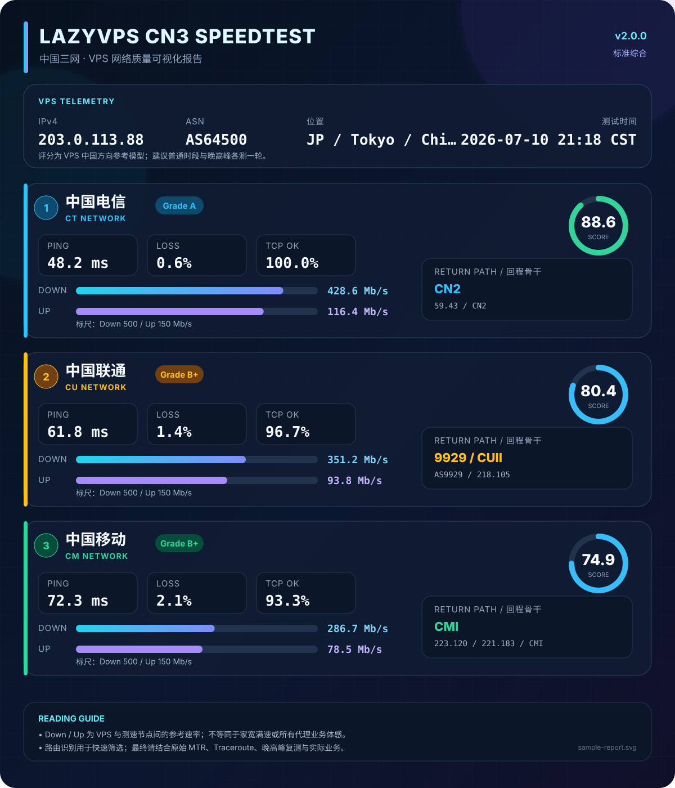

<div align="center">

# LazyVPS CN3 SpeedTest v2.1

### 全量容量压测 · 中国三网回程 · CMD / SVG Pro

<p>
  
  
  
  
</p>

**一套脚本同时量出单线、多线、最大上下行能力，以及中国电信／联通／移动的延迟、丢包与回程骨干。**

[快速开始](#一分钟开始) · [模式差异](#五种测试怎么选) · [SVG 报告](#svg-可视化报告) · [完整输出](#输出文件)

</div>

---

## 这次升级了什么

v2.1 在 v2.0 的三网测试基础上，完整整合旧版容量压测包的关键能力：

- ANSI 渐变 `LAZYVPS` 字幕＋“万马奔腾”ASCII 封面，首次进入轻量动画。
- 支持数字直选、`↑/↓`、`W/S`、`Enter`、`Q` 的 CMD／BBS 风格互动菜单。
- 新增单线下行、多线下行、最大下行、单线上行、多线上行、最大上行。
- 新增 HTTP 平均延迟、P50、P95、抖动、HTTP 层丢包率与 ICMP 品质。
- 每 250 ms 读取 Linux 网卡 RX/TX，最大值采用约 1 秒滚动峰值，减少瞬间尖峰误判。
- 自动保存容量时间序列 CSV 与完整原始 JSON，SVG 同时显示容量曲线和三网看板。
- 保留 Markdown、CSV、MTR、Traceroute 原始数据，视觉结论与底层证据一一对应。
- 修正旧 README 下载地址误指向 `souldance7-ai/VPS-` 的问题；正式地址统一为本仓库。

## SVG 可视化报告

下面这张图由脚本依据容量与三网 CSV 自动生成，不是截图；每次测试都会输出同结构的 `report.svg`。



## 一分钟开始

### 方法一：VPS 直接进入互动菜单

**VPS/Linux 执行：**

```bash
bash <(curl -fsSL https://raw.githubusercontent.com/souldance7-ai/vps-speedtest/main/cn3_vps_server_test.sh)
```

> 首次运行若缺少 MTR 或 Ookla Speedtest，请在菜单选择 `[6] 安装依赖`。

### 方法二：Windows CMD 远程触发标准测试

**Windows CMD 执行：**

```cmd
ssh root@你的VPS_IP "bash -lc 'curl -fsSL -o /root/cn3_vps_server_test.sh https://raw.githubusercontent.com/souldance7-ai/vps-speedtest/main/cn3_vps_server_test.sh && chmod +x /root/cn3_vps_server_test.sh && /root/cn3_vps_server_test.sh --install --standard'"
```

### 方法三：下载后长期使用

**VPS/Linux 执行：**

```bash
curl -fsSL -o /root/cn3_vps_server_test.sh https://raw.githubusercontent.com/souldance7-ai/vps-speedtest/main/cn3_vps_server_test.sh
chmod +x /root/cn3_vps_server_test.sh
/root/cn3_vps_server_test.sh
```

## 互动界面

```text
██╗      █████╗ ███████╗██╗   ██╗██╗   ██╗██████╗ ███████╗
██║     ██╔══██╗╚══███╔╝╚██╗ ██╔╝██║   ██║██╔══██╗██╔════╝
██║     ███████║  ███╔╝  ╚████╔╝ ██║   ██║██████╔╝███████╗
███████╗██║  ██║███████╗   ██║    ╚████╔╝ ██║     ███████║

┌──────────────────────────────────────────────────────────────────────┐
│ ▶ [2] 标准综合 │ 8 线程容量 + 三网完整测试 · 日常推荐             │
│ · [3] 深度三网 │ 12 线程容量 + 加强采样 · 高峰留档                │
│ · [4] 容量压测 │ 只测单线/多线/峰值上下行、HTTP/ICMP 品质         │
└──────────────────────────────────────────────────────────────────────┘
READY  当前 [2]  ↑↓ / W/S · Enter · Q
```

按键说明：

| 按键 | 动作 |
|---|---|
| `1`～`7`、`0` | 直接执行对应选项 |
| `↑ / ↓` 或 `W / S` | 移动选择 |
| `Enter` | 确认当前选项 |
| `Q` | 安全退出 |

## 五种测试怎么选

| 模式 | 容量参数 | 三网采样 | 路由 | 适用场景 |
|---|---|---|---|---|
| 快速 `--quick` | 4 线程，单线 4s／多线 5s | 每网 1 点 | 不跑 MTR | 新 VPS 快速筛选 |
| 标准 `--standard` | 8 线程，单线 6s／多线 8s | 每网 2 点 | MTR 20 包 | 日常完整判断，默认推荐 |
| 深度 `--deep` | 12 线程，单线 10s／多线 14s | 每网 3 点 | MTR 50 包 | 晚高峰留档、横向对比 |
| 容量 `--capacity-only` | 12 线程容量专测 | 不执行 | 不执行 | 只看最大上下行与稳定性 |
| 路由 `--route-only` | 不执行 | Ping / TCP | MTR 30 包 | 只看回程、延迟与丢包 |

实际时间取决于 VPS 性能、三网测速点状态与网络超时情况。

默认容量端点为 `https://speed.cloudflare.com`。如使用 `--capacity-endpoint` 更换端点，该服务需兼容 `/__down`、`/__up` 与 `/cdn-cgi/trace` 路径。

## 测试内容

| 维度 | 输出内容 | 用途 |
|---|---|---|
| VPS 基础信息 | IPv4 / IPv6、ASN、地区、系统、BBR、拥塞控制 | 确认测试对象与出口身份 |
| 单线容量 | 单线下行 Mbps、单线上行 Mbps | 判断单连接／单任务实际能力 |
| 多线容量 | 多线下行 Mbps、多线上行 Mbps、线程数 | 判断并发饱和能力 |
| 最大能力 | 最大下行 Mbps、最大上行 Mbps | 约 1 秒滚动峰值，观察短时上限 |
| HTTP 品质 | 平均、P50、P95、抖动、HTTP 层丢包率 | 判断网页、API 与代理交互稳定性 |
| ICMP 品质 | 平均延迟、抖动、丢包率 | 对照基础网络波动 |
| 延迟与稳定性 | Ping 平均／最低／最高、抖动、丢包 | 判断交互体感与波动 |
| TCP 连通 | 53 / 443 等目标端口成功率与耗时 | 避免只看 ICMP 造成误判 |
| 三网速度 | Ookla Down / Up，统一使用 Mb/s | 观察当前样本的传输能力 |
| 回程骨干 | CN2 / 163 / CTG、AS4837 / 9929、CMI / CMNET | 快速识别三网回程特征 |
| 综合评分 | CT / CU / CM 排名、等级、使用建议 | 用于同口径横向筛选 |

## 常用命令

### 标准模式并自动安装依赖

**VPS/Linux 执行：**

```bash
bash cn3_vps_server_test.sh --install --standard
```

### 深度模式

**VPS/Linux 执行：**

```bash
bash cn3_vps_server_test.sh --deep
```

### 只跑上下行容量与延迟丢包

**VPS/Linux 执行：**

```bash
bash cn3_vps_server_test.sh --capacity-only
```

**Windows CMD 执行：**

```cmd
ssh root@你的VPS_IP "bash -lc '/root/cn3_vps_server_test.sh --capacity-only'"
```

### 自定义采样与输出目录

**VPS/Linux 执行：**

```bash
bash cn3_vps_server_test.sh --standard --capacity-threads 12 --capacity-single-seconds 8 --capacity-multi-seconds 12 --http-samples 30 --out cn3_tokyo_peak
```

### 关闭颜色或首次封面动画

**VPS/Linux 执行：**

```bash
bash cn3_vps_server_test.sh --standard --no-color --no-animation
```

## 输出文件

```text
cn3_test_YYYYmmdd_HHMMSS/
├── report.svg                  # GitHub / 浏览器可直接显示的主视觉报告
├── report.md                   # 完整 Markdown 报告
├── capacity_summary.csv        # 单线／多线／最大上下行及 HTTP / ICMP 总表
├── capacity_timeseries.csv     # 每 250 ms 容量时间序列
├── capacity_raw.json           # 每阶段、每请求与方法口径的原始数据
├── cn3_overview.csv            # 三网排名与综合评分
├── latency_summary.csv         # Ping / 丢包 / TCP 明细
├── speedtest_summary.csv       # Down / Up 与测速点明细
├── route_backbone_summary.csv  # 回程骨干摘要
├── base_info.md                # VPS、IP、ASN 与系统信息
├── ookla_cn_servers.csv        # 本轮使用的三网测速点
├── speedtest_json/             # Ookla 原始 JSON
├── mtr/                        # MTR 原始记录
└── traceroute/                 # Traceroute 原始记录
```

`report.svg` 使用纯 SVG 元素与系统字体，不需要 JavaScript，也不依赖额外绘图库。

## 本地端闭环探测

VPS 端脚本负责“VPS → 中国三网”。如果还要补齐“中国本地 → VPS”的去程、端口和代理体感，可使用仓库里的客户端脚本。

**Windows CMD 执行：**

```cmd
powershell -NoProfile -ExecutionPolicy Bypass -Command "iwr -UseBasicParsing https://raw.githubusercontent.com/souldance7-ai/vps-speedtest/main/cn3_client_probe.ps1 -OutFile .\cn3_client_probe.ps1; .\cn3_client_probe.ps1 -VpsHost 你的VPS_IP -Ports 22,443 -Proxy http://127.0.0.1:7890"
```

**Linux/macOS 执行：**

```bash
bash cn3_client_probe.sh --host 你的VPS_IP --ports 22,443
```

再使用 `merge_lazyvps_report.py` 合并去程与回程：

```bash
python3 merge_lazyvps_report.py --server-dir cn3_test_xxx --client-dir cn3_client_test_xxx --out combined_report.md
```

## 评分与数据边界

- 容量测试会产生实际上下行流量，使用流量取决于线路能力、线程数与持续时间。
- 单线／多线是持续平均；最大值是网卡计数器约 1 秒滚动峰值，不是虚构的理论带宽。
- HTTP 抖动采用成功样本的总体标准差；HTTP 丢包率为失败请求占总样本比例。
- 评分是 **VPS 中国方向参考模型**，不是家宽跑满带宽考核。
- Speedtest 数值受测试节点、时段、路由与单连接状态影响，不代表线路绝对上限。
- DNS、官网目标可能禁 Ping 或受 CDN 调度影响；脚本同时参考 TCP，避免用单项结论替代整体判断。
- 回程识别基于 MTR / Traceroute 关键字自动归类，复杂路由请回看原始文件。
- 建议同一台 VPS 至少在普通时段与晚高峰各测一次，再比较稳定性。

## 项目结构

```text
vps-speedtest/
├── cn3_vps_server_test.sh      # 正式主入口 v2.1
├── cn3_vps_net_test_plus.sh    # 历史命令兼容入口
├── cn3_client_probe.ps1        # Windows 本地端探测
├── cn3_client_probe.sh         # Linux / macOS 本地端探测
├── merge_lazyvps_report.py     # 去程／回程报告合并
├── QUICK_START.md
├── RELEASE_NOTES_v2.1.md
├── tests/smoke.sh
└── docs/sample-report.svg
```

## License

[MIT](LICENSE) — 可自由使用、修改与分发；保留许可证与来源说明即可。

---

<div align="center">

**LazyVPS · 让测速结果不只是一串数字，而是一张能直接判断的工程看板。**

</div>
