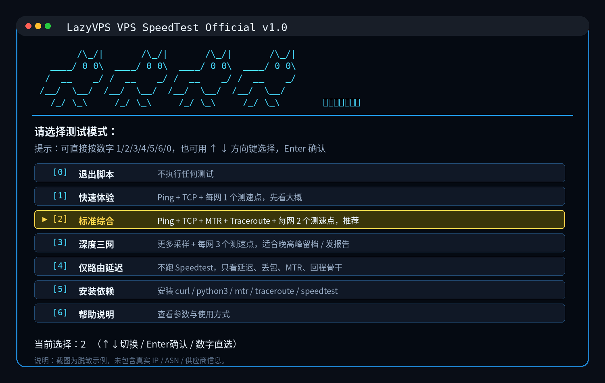
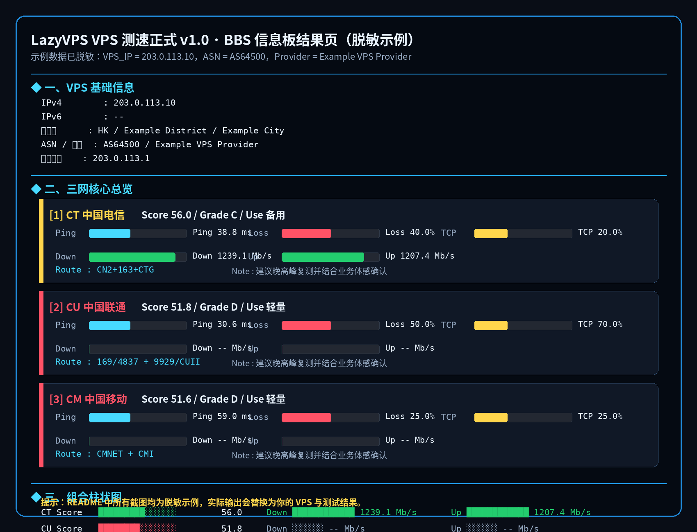
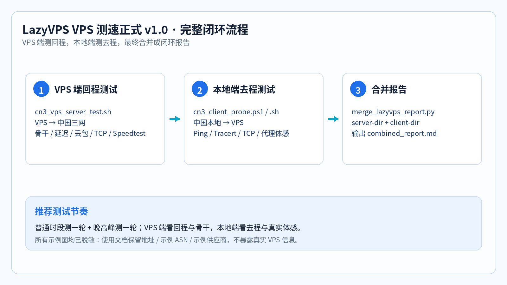

# LazyVPS VPS 测速正式 v1.0


## 独立工具：中国三网入口去程／TCP应答与专线映射核对 v1.2.2

`ix-route.sh` 与 `3net-route.sh` 完全独立，适用于“中国用户 → 中国侧公网入口 → NAT／IPLC／IEPL／中转隐藏内段 → 出口 VPS”架构。

正式版不再用“出口 VPS → 中国公共目标”的默认公网 traceroute 冒充专线回程。每组去程后只确认原中国探针是否收到同一入口、同一业务端口的 TCP 应答；该结果不是独立反向逐跳路由，也不计算回程分数。若能提供或自动识别入口端私网对端，才额外验证出口→入口私网对端的同路径内段回程。

v1.2.2 可用 `--speed` 在 CMD 与报告中追加北京、上海、广东三网单线程速度。新版把六地区 × 三网 RTT 改为证据网格，主标题直接显示 `中国三网探针 → 脱敏入口IP:脱敏端口`，每格列出实际探针省市、ASN、脱敏入口、精确／备援状态和 TCP 应答；顶部与运营商卡分开统计三网运营商探针和第三方参考点，避免把参考点应答算进中国电信等运营商探针。速度与重传使用色彩渐层条并显示方向箭头，已取得数据标为 `VALID` 而非质量 `PASS`，缺测保持 `N/A`。该辅助项来自固定提交版本的开源 [TcpQuality](https://github.com/ibsgss/TcpQuality)，测量“出口 VPS ↔ 中国三网公共测速端”，不经过中国侧业务入口，不参与隐藏专线映射链与真实协议握手判定。

### 在出口 VPS 一键执行完整六地区 × 三网

```bash
bash <(curl -fsSL "https://raw.githubusercontent.com/souldance7-ai/vps-speedtest/refs/heads/agent/fix-ix-forward-probes/ix-route.sh") --full --speed
```

脚本会依次引导输入：

- 中国侧公网入口 IPv4
- 协议业务端口（不是 SSH／管理端口）
- 预期公网出口（未知可留空）
- 出口端专线内网 IPv4（未知可留空）
- 入口端专线内网对端（未知可留空；脚本会尝试从活动连接识别）

`--full` 生成18组TCP去程＋对应18组原探针TCP应答确认，`--speed` 追加北上广三网九组公网单线程辅助测速。所有用户相关入口、出口、私网对端及客户端实测 IPv4 在 JSON、HTML、Markdown 与公共页中只保留前两段；业务端口末三位统一显示为 `***`。最终判定不输出分数／星级，并列出缺失证据、低速与高重传等建议改善。

[完整使用说明与判定边界](IX_ROUTE_GUIDE.md) · [查看脚本](ix-route.sh)

---

## 中国三网 VPS 双程质量检测 v1.0.0 正式版

适用于在 VPS 内直接检测中国电信、联通、移动的去程与回程质量，并生成 CMD、HTML、JSON、NodeSeek 与公共报告。脚本不会默认指定 443；未传 `--port` 时会询问协议实际监听的 TCP 业务端口。

### 四条固定执行指令（永久不变）

> 以下四条命令均在 **VPS／Linux 的 Bash** 中执行。以后发布正式版或新 RC 时，只更新固定文件内容，命令中的网址与文件名不再更换，也不再加入版本号、日期或 `?ver=` 参数。

#### 1）正式标准版（推荐日常检测）

```bash
bash <(curl -fsSL --retry 3 "https://raw.githubusercontent.com/souldance7-ai/vps-speedtest/main/3net-route.sh")
```

#### 2）正式含测速版

```bash
bash <(curl -fsSL --retry 3 "https://raw.githubusercontent.com/souldance7-ai/vps-speedtest/main/3net-route-speed.sh")
```

#### 3）开源 RC 标准版

```bash
bash <(curl -fsSL --retry 3 "https://raw.githubusercontent.com/souldance7-ai/vps-speedtest/main/3net-route-rc.sh")
```

#### 4）开源 RC 含测速版

```bash
bash <(curl -fsSL --retry 3 "https://raw.githubusercontent.com/souldance7-ai/vps-speedtest/main/3net-route-rc-speed.sh")
```

### 固定入口说明

| 通道 | 固定文件 | 默认内容 |
|---|---|---|
| 正式标准版 | `3net-route.sh` | 北上广三网双程，不执行单线程测速 |
| 正式含测速版 | `3net-route-speed.sh` | 六地区扩展＋北上广三网 9 组单线程测速 |
| RC 标准版 | `3net-route-rc.sh` | 新功能公开验证，不执行单线程测速 |
| RC 含测速版 | `3net-route-rc-speed.sh` | RC 六地区扩展＋9 组单线程测速 |

运行后填写协议实际监听的 TCP 业务端口，不要填写 SSH 端口 `22`。正式／RC 的含测速入口会自动加入 `--extended --speed`，不必再手动输入参数。测试完成后，CMD 会同步显示浅色报告与深色报告链接；网页可切换主题，并分别复制 NodeSeek 浅色高清／深色高清格式。

> 正式版用于日常检测；RC 版用于新功能验证。若未来新增独立工具，只新增文件名，不改动上述四个稳定入口。

### 下载到 VPS 后执行正式标准版

```bash
curl -fsSL --retry 3 https://raw.githubusercontent.com/souldance7-ai/vps-speedtest/main/3net-route.sh -o /root/3net-route.sh && chmod +x /root/3net-route.sh && bash /root/3net-route.sh
```

### Windows CMD 远程触发正式标准版

```cmd
ssh root@你的VPS_IP "bash -lc 'curl -fsSL --retry 3 https://raw.githubusercontent.com/souldance7-ai/vps-speedtest/main/3net-route.sh -o /root/3net-route.sh && chmod +x /root/3net-route.sh && bash /root/3net-route.sh'"
```

### 已测报告免重跑上传

```bash
bash <(curl -fsSL --retry 3 "https://raw.githubusercontent.com/souldance7-ai/vps-speedtest/main/3net-route.sh") --retry-upload "/root/中国三网VPS双程质量报告_YYYYMMDD_HHMMSS.json"
```

公共报告会先尝试标准 POST，失败后再尝试公共 GET 分段通道。若来源网络仍被边缘层拒绝，本地 HTML／JSON 会继续保留，可稍后用固定正式入口执行 `--retry-upload`；不需要自建中继、密钥或来源白名单。

> 当前正式版：v1.0.0 FINAL。当前公开 RC 基线：v0.9 RC4.2.26。执行命令以后不随内部版本号变化。

---

<p align="center">
  <b>中国三网 VPS 综合闭环测速工具包</b><br>
  <sub>VPS 回程 · 中国本地去程 · 代理体感 · BBS 信息板 · Markdown / CSV / MTR / Traceroute 留档</sub>
</p>

<p align="center">
  
  
  
  
  
</p>

---

## 项目简介

`LazyVPS VPS 测速正式 v1.0` 是一个面向 **海外 VPS / 中转机 / 代理节点** 的中国三网综合测速工具包。

它不是单纯跑网速，也不是家宽满速模型，而是围绕 VPS 在中国联外网环境下的真实可用性做闭环观察：

```text
中国本地端  →  海外 VPS  →  中国三网目标
     去程          VPS端           回程
```

> **评分口径：** VPS 中国方向参考模型，评级仅供参考。建议普通时段 + 晚高峰各测一轮。

---

## 界面预览（已脱敏）

> 下方图片为 README 展示用脱敏示例，使用文档保留 IP、示例 ASN 与示例供应商，不暴露真实 VPS 信息。

### 1）交互菜单界面



### 2）测速结果仪表盘



### 3）完整闭环流程



---

## 一句话快速使用

### Windows CMD：远程触发 VPS 标准测速

> 适合在 Windows CMD 里操作，让 VPS 自己下载并执行测试脚本。

**Windows CMD 执行：**

```cmd
ssh root@你的VPS_IP "bash -lc 'curl -fsSL -o /root/cn3_vps_server_test.sh https://raw.githubusercontent.com/souldance7-ai/VPS-/main/cn3_vps_server_test.sh && chmod +x /root/cn3_vps_server_test.sh && bash /root/cn3_vps_server_test.sh --standard'"
```

示例：

```cmd
ssh root@你的VPS_IP "bash -lc 'curl -fsSL -o /root/cn3_vps_server_test.sh https://raw.githubusercontent.com/souldance7-ai/VPS-/main/cn3_vps_server_test.sh && chmod +x /root/cn3_vps_server_test.sh && bash /root/cn3_vps_server_test.sh --standard'"
```

> Windows CMD 不要直接执行 `bash <(curl ...)`，那是 Linux Bash 语法。

---

## 快捷命令

### 1. Windows CMD：VPS 标准测速

```cmd
ssh root@你的VPS_IP "bash -lc 'curl -fsSL -o /root/cn3_vps_server_test.sh https://raw.githubusercontent.com/souldance7-ai/VPS-/main/cn3_vps_server_test.sh && chmod +x /root/cn3_vps_server_test.sh && bash /root/cn3_vps_server_test.sh --standard'"
```

### 2. Windows CMD：VPS 安装依赖并测速

```cmd
ssh root@你的VPS_IP "bash -lc 'curl -fsSL -o /root/cn3_vps_server_test.sh https://raw.githubusercontent.com/souldance7-ai/VPS-/main/cn3_vps_server_test.sh && chmod +x /root/cn3_vps_server_test.sh && bash /root/cn3_vps_server_test.sh --install --standard'"
```

### 3. Windows CMD：VPS 深度测速

```cmd
ssh root@你的VPS_IP "bash -lc 'curl -fsSL -o /root/cn3_vps_server_test.sh https://raw.githubusercontent.com/souldance7-ai/VPS-/main/cn3_vps_server_test.sh && chmod +x /root/cn3_vps_server_test.sh && bash /root/cn3_vps_server_test.sh --deep'"
```

### 4. Windows 本地端：去程 + TCP + 代理体感

```cmd
powershell -NoProfile -ExecutionPolicy Bypass -Command "iwr -UseBasicParsing https://raw.githubusercontent.com/souldance7-ai/VPS-/main/cn3_client_probe.ps1 -OutFile .\cn3_client_probe.ps1; .\cn3_client_probe.ps1 -VpsHost 你的VPS_IP -Ports 22,443 -Proxy http://127.0.0.1:7890"
```

### 5. Windows 本地端：只测去程 / TCP 端口

```cmd
powershell -NoProfile -ExecutionPolicy Bypass -Command "iwr -UseBasicParsing https://raw.githubusercontent.com/souldance7-ai/VPS-/main/cn3_client_probe.ps1 -OutFile .\cn3_client_probe.ps1; .\cn3_client_probe.ps1 -VpsHost 你的VPS_IP -Ports 22,443"
```

### 6. VPS/Linux：进入菜单模式

```bash
curl -fsSL -o cn3_vps_server_test.sh https://raw.githubusercontent.com/souldance7-ai/VPS-/main/cn3_vps_server_test.sh
chmod +x cn3_vps_server_test.sh
bash cn3_vps_server_test.sh
```

---

## 菜单模式

在 VPS 上直接执行：

```bash
bash cn3_vps_server_test.sh
```

进入交互菜单：

```text
0  退出脚本
1  快速体验
2  标准综合
3  深度三网
4  仅路由延迟
5  安装依赖
6  帮助说明
```

支持：

```text
- 直接按数字 1 / 2 / 3 / 4 / 5 / 6 / 0
- 使用 ↑ ↓ 方向键选择，Enter 确认
```

---

## 功能总览

| 模块 | 执行位置 | 主要测试 |
|---|---|---|
| VPS 端测速 | 海外 VPS | VPS → 中国三网，回程、骨干、延迟、丢包、TCP、Speedtest |
| 本地端探测 | Windows / Linux / macOS | 中国本地 → VPS，去程、端口、Traceroute、代理体感 |
| 合并报告 | Windows / VPS / Linux | 汇总回程、去程、代理体感，生成闭环 Markdown 报告 |

---

## VPS 端测试内容

脚本：`cn3_vps_server_test.sh`

- VPS 基础信息
- 出口 IP / ASN / 归属地
- 中国电信 / 联通 / 移动 Ping
- 丢包率
- TCP Connect 成功率
- MTR / Traceroute 原始路由
- 回程骨干识别：
  - 电信：`CN2 / 163 / CTG`
  - 联通：`169 / AS4837 / 9929 / CUII`
  - 移动：`CMNET / CMI`
- Speedtest 中国方向 Down / Up
- CMD BBS 信息板结果页
- Markdown / CSV 输出

---

## 本地端测试内容

脚本：

```text
cn3_client_probe.ps1    Windows 本地端
cn3_client_probe.sh     Linux / macOS 本地端
```

测试：

- 本地 Ping VPS
- 本地 Tracert / Traceroute VPS
- TCP 端口连通
- 可选代理体感：
  - Cloudflare
  - Google 204
  - GitHub
  - OpenAI

---

## 合并报告

脚本：`merge_lazyvps_report.py`

```bash
python merge_lazyvps_report.py --server-dir cn3_test_xxx --client-dir cn3_client_test_xxx --out combined_report.md
```

输出一个完整的闭环 Markdown 报告。

---

## 输出目录

### VPS 端输出

```text
cn3_test_YYYYmmdd_HHMMSS/
├── report.md
├── cn3_overview.csv
├── route_backbone_summary.csv
├── latency_summary.csv
├── speedtest_summary.csv
├── mtr/
└── traceroute/
```

### 本地端输出

```text
cn3_client_test_YYYYmmdd_HHMMSS/
├── client_report.md
├── client_summary.csv
├── tcp_ports.csv
├── proxy_experience.csv
└── tracert_to_vps.txt
```

---

## 推荐测试流程

### 第一步：VPS 测回程

```cmd
ssh root@你的VPS_IP "bash -lc 'curl -fsSL -o /root/cn3_vps_server_test.sh https://raw.githubusercontent.com/souldance7-ai/VPS-/main/cn3_vps_server_test.sh && chmod +x /root/cn3_vps_server_test.sh && bash /root/cn3_vps_server_test.sh --standard'"
```

### 第二步：本地测去程

```cmd
powershell -NoProfile -ExecutionPolicy Bypass -Command "iwr -UseBasicParsing https://raw.githubusercontent.com/souldance7-ai/VPS-/main/cn3_client_probe.ps1 -OutFile .\cn3_client_probe.ps1; .\cn3_client_probe.ps1 -VpsHost 你的VPS_IP -Ports 22,443 -Proxy http://127.0.0.1:7890"
```

### 第三步：合并报告

```cmd
python merge_lazyvps_report.py --server-dir cn3_test_xxx --client-dir cn3_client_test_xxx --out combined_report.md
```

---

## 文件结构

```text
LazyVPS-VPS-SpeedTest-v1.0/
├── cn3_vps_server_test.sh
├── cn3_client_probe.ps1
├── cn3_client_probe.sh
├── merge_lazyvps_report.py
├── README.md
├── QUICK_START.md
├── RELEASE_NOTES_v1.0.md
├── LICENSE
└── docs/
    ├── interactive-menu-sanitized.png
    ├── result-dashboard-sanitized.png
    └── workflow-closed-loop.png
```

---

## 注意事项

- Windows CMD 不能直接执行 `bash <(curl ...)`。
- `bash <(curl ...)` 只适合 Linux Bash。
- Windows CMD 请使用 `ssh root@VPS "bash -lc '...'"` 远程触发 VPS 执行。
- Speedtest Down / Up 为 VPS 与测速节点之间的参考，不等于所有本地网络体感。
- 评分为 VPS 中国方向参考模型，不是家宽满速模型。
- 最终判断建议普通时段与晚高峰各测一轮。
- README 截图均为脱敏示例，不包含真实 VPS IP / ASN / 供应商。

---

## License

MIT
