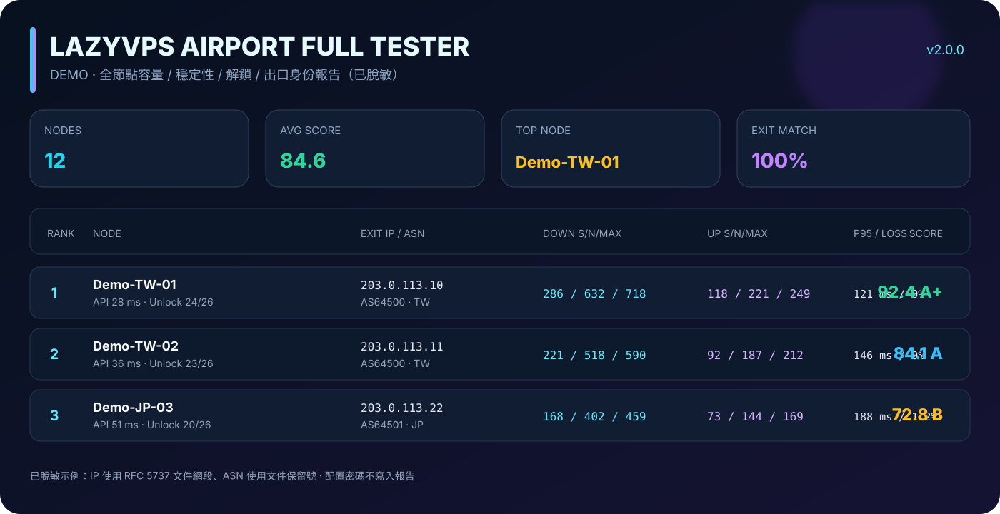

# LazyVPS Airport Full Tester




一套給 Windows CMD、FLClash 與 Mihomo 使用的「機場全節點測評包」。把 Clash/Mihomo 的 YAML 配置拖到 CMD，即可用隔離的本機核心逐一切換節點；也可以直接連接已啟動的 FLClash/Mihomo Controller。v2.0 全面統一 UTF-8，並輸出科技版 SVG、互動 HTML、真正的多工作表 Excel，以及 CSV/JSON 原始明細。

> **公開範例已完全脫敏：** 範例只使用 RFC 5737 文件專用 IP（`203.0.113.0/24`）與文件用 ASN，不代表任何真實伺服器、供應商或使用者。配置、訂閱內容、節點伺服器地址與 Controller 密碼只在本機使用，不會寫進報告。

## 30 秒開始

### 方法 A：把配置拖進 CMD（最方便）

1. 下載本資料夾。
2. 第一次使用，雙擊 `setup_mihomo.cmd`，下載官方 Mihomo Windows 核心。
3. 把你的 `.yaml` 或 `.yml` 配置檔拖到 `run_airport_tester.cmd` 上；也可以只放一個 YAML 在同資料夾後直接雙擊 CMD，程式會自動找到它。
4. 用 `↑` / `↓`、`W` / `S` 或數字選擇模式，按 Enter 執行。
5. 結果會存到本資料夾內的 `airport_test_日期_時間\`。

腳本會把原配置複製到 Windows 暫存目錄，改用隔離的 `127.0.0.1:19080` 與 `127.0.0.1:19090`，測試結束後自動停止核心並刪除暫存副本，不改動原配置。

若資料夾內同時有兩個以上 YAML，為避免測錯配置，CMD 會停止並提示你把指定 YAML 拖到 CMD 上。

### 方法 B：連接正在運行的 FLClash / Mihomo

直接雙擊 `run_airport_tester.cmd`。預設使用：

- HTTP/Mixed Proxy：`http://127.0.0.1:7890`
- External Controller：`http://127.0.0.1:9090`
- 優先代理組：`PROXY`，找不到時自動選擇可切換群組

若 Controller 有密碼或連接埠不同，把 `settings.tpe101.example.json` 複製為 `settings.json` 後修改。`settings.json` 已被 `.gitignore` 排除，請勿把密碼提交到 GitHub。

## 互動模式

| 模式 | 適合情境 | 內容 |
|---|---|---|
| 快速全節點 | 先篩掉品質較差的節點 | 核心平台、輕量容量、出口 IP、穩定性 |
| 標準全功能 | 日常完整比較，預設推薦 | 4 線程容量、12 次穩定性、26 平台、出口身份 |
| 深度穩定性 | 長時間或商用線路驗證 | 8 線程容量、30 次採樣、完整平台矩陣 |
| 容量優先 | 找單線、多線與峰值上限 | 單線/多線/最大下載與上傳、延遲與丟失率 |
| 解鎖矩陣 | 比較 AI、串流與開發平台 | 26 平台 HTTP 可用性矩陣，不跑容量壓測 |
| 連接診斷 | 驗證 Controller 與節點切換 | API、出口、TLS/HTTPS 與核心平台快檢 |

平台清單包含 ChatGPT、OpenAI API、Claude、Gemini、Perplexity、Copilot、YouTube、Netflix、Disney+、Prime Video、HBO Max、DAZN、動畫瘋、Abema、TikTok、Spotify、Steam、Instagram、GitHub、Apple TV+、Twitch、Crunchyroll、BBC iPlayer、Hulu、Peacock 與 BiliBiliIntl。

主矩陣的 `Status` 固定為「解鎖成功 / 解鎖失敗」，HTTP 狀態碼與延遲保留在明細欄。部分服務會因登入、Cookie、風控或區域頁面策略而改變回應，因此這是批次可達性評估，不等同於實際帳號播放授權；重要節點仍建議進站複核。

## 輸出檔案

| 檔案 | 用途 |
|---|---|
| `report.svg` | 深色視覺化排行榜；GitHub、瀏覽器與多數聊天軟體可直接查看 |
| `report.html` | 科技封面、SVG 看板、節點搜尋與響應式完整排名表 |
| `report.xlsx` | 真正 Excel 工作簿：Dashboard、Ranking、Services、Speed、Stability、Topology、TLS 等工作表 |
| `summary_ranking.csv` | 節點總分、等級、延遲、丟失率、容量與出口摘要 |
| `service_matrix.csv` | 26 平台解鎖成功/失敗、HTTP Code 與延遲 |
| `speed_samples.csv` | 容量測試的時間序列與瞬時 Mb/s |
| `stability_timeseries.csv` | HTTP 多次採樣、失敗與延遲時間序列 |
| `api_delay.csv` | Mihomo API 的節點延遲結果 |
| `tls_https_probe.csv` | DNS、TCP、TLS Ready、總耗時與憑證驗證結果 |
| `topology_ip.csv` | 外部網站看到的公網出口 IP、國家、ASN、ISP 與台北101 IP 比對 |
| `group_membership.csv` | Controller 回傳的群組與成員關係，方便檢查選組 |
| `selected_nodes.csv` | 這次實際測試的去重節點清單 |
| `route_switch_log.csv` | 每次切換成功/失敗與錯誤訊息 |
| `run_args.json` | 本次非敏感執行參數；只記錄是否配置 Secret，不寫 Secret 本身 |

`198.18.0.0/15` 是 Clash 常見 Fake-IP 範圍，本工具不把它當作入口或出口 IP。出口 IP 只採用經目前節點代理、由外部 IP 服務看到的公網地址；入口伺服器地址刻意不寫報告，避免洩露配置內容。

## 預期出口 IP 與分享脫敏

範例 `settings.tpe101.example.json` 已放入以下預設：

```json
{
  "controller": "http://127.0.0.1:9090",
  "proxy": "http://127.0.0.1:7890",
  "group": "PROXY",
  "expected_exit_ip": "",
  "redact_report_ip": false,
  "mode": "standard"
}
```

`expected_exit_ip` 預設留空，不包含任何使用者真實 IP。需要比對時只在自己的 `settings.json` 填入；準備公開 SVG、HTML、CSV 或 JSON 時，把 `redact_report_ip` 改成 `true`，報告中的實際出口與預期出口會改顯示為 `REDACTED`。

## PowerShell 進階用法

```powershell
# 只測名稱包含「台灣、台北、Taipei」的前 10 個節點
.\airport_full_tester.ps1 -Mode standard -NodePattern '台灣|台北|Taipei|TW' -MaxNodes 10

# 連自訂 Controller / Proxy
.\airport_full_tester.ps1 -Mode diagnostic `
  -Controller 'http://127.0.0.1:9090' `
  -Proxy 'http://127.0.0.1:7890' `
  -Secret '你的本機 Controller 密碼'

# 指定 YAML，啟動隔離核心並輸出到固定目錄
.\airport_full_tester.ps1 -ConfigPath 'D:\configs\airport.yaml' `
  -Mode deep -OutDir 'D:\reports\taipei101'

# 產生可公開分享的脫敏報告
.\airport_full_tester.ps1 -Mode standard -RedactReportIp
```

可用參數：`-Mode`、`-ConfigPath`、`-Controller`、`-Proxy`、`-Secret`、`-Group`、`-ExpectedExitIp`、`-RedactReportIp`、`-NodePattern`、`-MaxNodes`、`-OutDir`、`-MihomoPath`、`-CapacityEndpoint`、`-NoLaunch`、`-NoColor`。

## 測試流量與安全

- 容量模式會產生實際下載與上傳流量。先用「快速」或 `-MaxNodes` 控制消耗，避免超出機場流量額度。
- 僅對你有權使用的配置與節點執行測試，並遵守供應商條款。
- Mihomo 由官方 `MetaCubeX/mihomo` GitHub Releases 下載，`setup_mihomo.ps1` 不會從第三方鏡像取得核心。
- SVG/HTML/CSV 報告預設供本人分析，會含節點名稱與公開出口 IP。對外分享前請啟用 `-RedactReportIp`，並自行確認節點名稱是否也適合公開。

## 相容性

- Windows 10 / 11 x64
- Windows PowerShell 5.1
- 內建 `curl.exe`
- FLClash 或 Mihomo External Controller API

專案採用根目錄的 MIT License。
